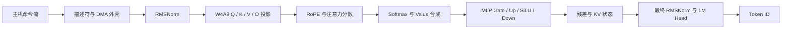
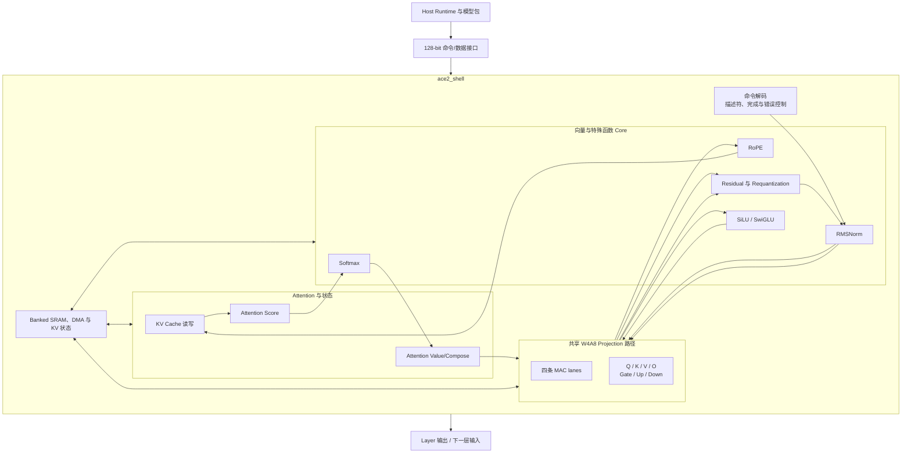

<div align="center">

# Argus Compute Engine 2（ACE-2）

### 以证据为核心的 Qwen2.5-0.5B W4A8 加速器工程

[English](README.md) | [简体中文](README.zh-CN.md)

[](https://github.com/aHappend/ace-2/releases)
[](LICENSE)
[](rtl/)
[](docs/PPA_SUMMARY.md)
[](https://github.com/Argus-AiTeam)
[](KNOWN_LIMITATIONS.md)

**ACE 即 Argus Compute Engine。ACE-2 的设计、实现、测试、审查和持续迭代主要由
[Argus](https://argusbot.cn/) 在人类定义的目标与发布权限下自主完成。**

</div>


## 2026-09-06：仅发布证据摘要的进展更新

详见[完整里程碑说明](docs/results/ACE2_PROGRESS_20260906.md)及
[机器可读溯源](evidence/public/ace2-progress-20260906/provenance.json)。
**现有公开源码不变；本次不是较新本地实现的可运行发布。**

V74 记录了 35 个位置、840 次 RTL 层调用，输出 ` aside crystal`，不代表有用对话。
regression 0006 是历史证据审计加新的 shell smoke，不是重跑 840 层。
同一 LoRA176 的六个冻结短问题中，BF16 为 **6/6**，当前 Stage-1 W4A8+rank1
为 **0/6**；这不是通用准确率，完整[十二条回答和限制](docs/results/CURRENT_LORA176_SOFTWARE_QUALITY_20260906.md)
一并公开。三次递增诊断对照没有修复代表性回答；新的 S16 residual 局部合并 MAE
降低 99.30%，但普通通道归一化输出仍有 839/887 为零，也尚未接入 runtime/RTL。

**当前只做本地仿真和软件诊断；硬件 Stage 2、FPGA、综合、PPA、U280 已取消。**
下方 Alpha 2/3 结果与旧计划作为历史记录保留，不代表新路径成果或当前执行授权。
本次边界见[发布说明](docs/results/PUBLICATION_BOUNDARY.md)。

> **Alpha 3 的范围：**这是建立在 Alpha 2 已认证 RTL 基线之上的公开产品化进展快照。
> Alpha 2 基线保持不变；Alpha 3 记录了后续 BF16 模型质量工作，以及目前仍阻止任意文本
> W4A8 对话和 U280 部署的具体门禁。Alpha 3 不声明新的已认证模型、通用对话能力、
> FPGA 执行、布线后签核或硅片成果。

## Alpha 3 进展概览

| 项目 | Alpha 3 状态 |
|---|---|
| 已认证 RTL 基线 | **完整保留 Alpha 2，未发生变化** |
| Layer-0 定点算子 | **18 / 18 精确通过** |
| 完整运行时命令 | **13,914 / 13,914 通过** |
| 已演示模型路径 | **24 层，生成两个 token** |
| SKY130 映射结果 | **62,283 个单元，0.614082704 mm²** |
| 时序 | **100 MHz 通过，setup slack 为 +0.6966 ns** |
| BF16 后继模型 | **S6 在 probe gate 处 NO-GO 封存，未访问 official dev** |
| 执行准入 | **V8 恢复包已获 Fresh-L2 接受；仍需要外部 root** |
| 已记录的生成诊断 | **固定 `Hi` 输入完成并输出 `[529, 529]`（`ertert`）；仅代表生成能力证据** |
| 任意文本 W4A8 对话 | **尚未验收** |
| Alveo U280 部署 | **尚未开始，需要外部工具链和板卡** |

模型修订、镜像哈希、调度哈希、机器可读身份以及 Alpha 2 的精确认证边界，统一记录在
[CERTIFICATION.md](CERTIFICATION.md) 中。后续工作及其明确的非声明边界见
[Alpha 3 产品化进展](docs/ALPHA3_PROGRESS.md)。

最新的公开安全产品化结果没有扩大已认证 RTL 基线。V8 host-trust 恢复包通过了
58 项验证，报告零 issue，并以内容 SHA-256
`07663099352edfad32eb39919ad9475f1f887328ebb549bdb9cae1c48f5ccad1`
获得 Fresh-L2 接受。其状态为 `BUILD_READY_EXTERNAL_ROOT_REQUIRED`：尚未安装，
没有发生特权执行，Stage 1 也尚未完成。详见
[Host-trust 恢复状态](docs/HOST_TRUST_RECOVERY.md)。

## 为什么 ACE-2 是 Argus 的成果

ACE-2 是 [Argus AI Team](https://github.com/Argus-AiTeam) 公开成果体系的一部分。
Argus 完成了主要的迭代工程闭环：架构拆解、RTL 与 oracle 实现、确定性测试生成、
长时间验证、失败定位、证据绑定、Reviewer 交接，以及 fail-closed 回滚决策。
人类保留任务目标、预算、授权、凭据和对外发布等边界的最终控制权。

“由 Argus 制作”并不替代证据。仓库明确区分已验收结果、失败候选、可复现 Demo
和非声明边界。完整说明见 [Argus 设计溯源](ARGUS_PROVENANCE.md)。

独立审查过的固定输入生成记录见
[公开双 token 诊断证据包](evidence/public/fixed-hi-two-token-diagnostic-v1/)。
该记录完成了 175,855 条 Verilated 命令并输出 token IDs `[529, 529]`，静态解码为
`ertert`。它只证明记录中的生成执行发生过，不代表输出质量或任意文本对话能力。

## ACE-2 包含什么



公开版本包含已认证 RTL、确定性定点参考实现、生成式测试向量、Verilator/Icarus
测试平台、镜像与运行时工具，以及版本内自带的 SKY130 流程脚本。

以下内容不随仓库分发：

- 模型权重与训练 checkpoint；
- 专有 PDK 数据和私有评测集；
- 本地构建产物与运行日志；
- 受保护或已封存的内部执行证据。

### 当前 RTL 组织结构

ACE-2 实现的是一套可重复使用的 Transformer Layer 引擎，而不是在芯片中物理复制
24 份 Layer。Host 选择当前层、提供权重与描述符，按顺序调用各算子，再将输出隐藏状态
作为下一层输入。



当前架构采用命令驱动和资源复用方式：

- 同一套 Layer 引擎重复执行所有模型层和 token 位置；
- 七个主要 Projection 共享一条 W4A8 MAC 路径；
- RMSNorm、RoPE、Softmax 和 SiLU 是相对独立、可复用的 Core；
- KV 状态跨 token 保存；
- 各算子按顺序执行，目前还不是整层自主流水线；
- Fused `0x0b` 指令会用一个有序描述符执行 Q、K、V，并复用 Activation Tile；
  它并没有增加三套独立 Projection Engine；
- 更大的 Qwen 和其他 Decoder-only 模型仍需要计划中的参数化模型硬件契约。

这种结构能够控制面积并提高 IP 复用性，同时也明确了后续优化方向：增加 MAC 并行度、
进行算子融合，以及分别优化 Prefill 和 Decode 调度。

### Fused QKV 数据流

Shell 可以缓存一个包含 56 个 Beat、共 896 Bytes 的 Activation Tile，并按顺序在
Q、K、V Projection 阶段复用。原有三描述符路径继续保留。在冻结的
Qwen2.5-0.5B 形状 RTL Benchmark 中：

| 指标 | 原有 Q/K/V | Fused QKV |
|---|---:|---:|
| 命令数 | 3 | 1 |
| Activation Reads | 64,512 | 56 |
| 总 Reads | 97,920 | 33,464 |
| Simulator Cycles | 1,044,326 | 805,011 |

两种模式的全部 1,152 个输出 Bytes 均与同一个定点 Oracle 位精确一致，并覆盖
Backpressure、Reset/Restart、错误 Read Tag 和旧指令兼容性。这是有界 Projection
结果，不代表完整模型聊天或 Full-shell 时序闭合。

```sh
make fused-qkv-freeze
make fused-qkv-check
```

### 不可变 PPA Preflight

`flow/immutable_ppa/` 为后续 Base/Candidate SKY130 对比提供 non-consuming
Preflight。它会冻结 12 个 Shell 参数、64 个公开端口、Fused-QKV 契约、
RTL/SDC/Flow 哈希、Container Digest，以及 Yosys/OpenSTA/Library 的绝对路径。
Preflight 只验证并渲染命令，设计上无法执行综合或 STA。

```sh
python3 flow/immutable_ppa/benchmark_interface.py --repo "$PWD"
python3 -m unittest \
  flow/immutable_ppa/test_benchmark_interface.py \
  flow/immutable_ppa/test_immutable_ppa.py
```

正式对比 Namespace 使用 Exclusive-create，并拒绝覆盖或重试。该 Package 本身不包含
PPA、时序闭合或 FPGA 声明。

### 参数化 Qwen2.5 模型契约

ACE-2 现已包含 Qwen2.5 0.5B、1.5B、3B 和 7B 的可执行模型硬件描述。
统一 schema 会检查模型尺寸、GQA 结构、精度选择、内存布局要求，以及权重和 KV
容量估算。

```sh
make model-hardware-contract-check
```

| 模型 | 契约范围 | 估算打包权重 | 最大权重与 KV 估算 |
|---|---|---:|---:|
| Qwen2.5-0.5B | 现有 Package/Runtime Preflight | 526.7 MB | 740.6 MB |
| Qwen2.5-1.5B | 仅结构契约 | 1.25 GB | 3.19 GB |
| Qwen2.5-3B | 仅结构契约 | 2.18 GB | 2.81 GB |
| Qwen2.5-7B | 仅结构契约 | 4.65 GB | 8.53 GB |

大模型描述证明的是机器可检查的结构契约，**不代表** 1.5B、3B 或 7B 已经在 RTL
中实际运行。最大容量使用各模型声明的最大上下文计算，是规划上界而不是板卡实测分配。

### 混合精度规划

同一条检查命令还会为四种模型契约生成确定性的精度方案：

| 策略 | 目标用途 | 当前状态 |
|---|---|---|
| `w4a8` | W4 Projection 与 A8 Activation/KV 路径 | 当前 RTL 格式 |
| `w8a8` | 更高精度的 Projection 候选 | 仅结构候选，无 RTL 执行声明 |
| `mixed_w4a8_a16_bf16` | W4 Projection 与局部 A16/BF16 敏感算子 | 仅结构候选，无 RTL 执行声明 |

每份方案记录逐算子精度、权重/KV 容量估算、最大上下文 Decode 流量、描述符哈希和明确
的硬件支持状态。Validator 会对 schema 或类型不一致 fail-closed，并包含 signed-int4
ties-to-even 打包参考。在对应 RTL 完成并通过验证前，W8A8 和混合 BF16 仍属于软硬件
协同设计方案。

## 开放 IP 库

[ACE-2 开放 IP 库](IP_LIBRARY.zh-CN.md)将规范 RTL 整理为 9 个带机器可读 manifest
的复用包。它明确区分独立 core（`rmsnorm`、`rope`、`softmax`、投影与
SiLU/SwiGLU）、带共享 shell 集成的 Attention core、由 shell 实现的 KV 写入路径，
以及 MLP/Transformer Layer 集成包。

```sh
make ip-list
make ip-validate
make ip-demo IP=rmsnorm
make ip-softmax
```

功能包结果写入 `build/ip_library/`。现有 18 个算子 Demo 证明了列出的 ACE-2 路径，
但并非每个算子名称都对应完全独立的 standalone core。每个 manifest 都记录规范源码、
Qwen2.5-0.5B 参数、接口、依赖、证明映射和限制。该整理不声明任意 Transformer 支持、
完整模型对话或 FPGA 部署。

## 运行可视化 Demo

安装 Python 3、GNU Make、Verilator 和 Icarus Verilog，然后运行：

```sh
make demo
```

该 Demo 不会重放十亿周期级的完整模型认证。它执行的是一条快速、适合公开复现、
并且绑定用户本机的证据链：

1. 校验每个已认证 RTL 文件的哈希；
2. 检查开源工具链；
3. lint 完整加速器外壳；
4. 使用独立 oracle 重新生成确定性 RMSNorm 向量；
5. 对 15 个 RTL 用例、每个 56 个 beat 进行仿真并比对预期结果；
6. 在命令启动后生成一个不可预存的本机随机 challenge，并重新编译 RTL；
7. 为 challenge 执行生成 VCD 波形；
8. 故意破坏一个期望结果，证明 checker 会真实拒绝错误；
9. 为 5 组 Transformer 核心生成带种子的随机题，用位精确 Python 参考模型计算答案，
   并逐项对比 RTL 输出；
10. 运行 6 个 `ace2_shell` 集成模式；
11. 展示全部 18 个已认证 Layer-0 算子，并区分快速 Demo 本次执行与慢速完整
    shell 覆盖；
12. 生成包含 challenge、工具版本、源码 commit、日志和输出 hash 的可视化证据面板。

预期的最终标记为：

```text
ACE2_LOCAL_RTL_DEMO_PASS
```

生成的报告位于：

```text
build/DEMO_REPORT.html
```

如果暂时不安装仿真工具链，也可以直接查看
**[Alpha 2 示例证据报告](docs/DEMO_REPORT.md)**。
完整操作流程与原始 artifact 映射见 [DEMO.md](DEMO.md)。

如需运行包含慢速投影、KV Write 和 Attention Value 路径的完整公开 shell 回归：

```sh
make demo-extended
```

可用 `make demo SEED=<报告中的种子>` 原样重放同一组随机题。

可以逐个查看 18 个 Layer-0 算子的支持情况：

```sh
make demo-operators              # 列出全部 18 个名字
make demo-softmax
make demo-mlp-up                 # 较慢：完整 896 x 4864 投影
make demo-operator OP=kv-write   # 等价的通用写法
```

每条命令都会在 `build/single_operator/<operator>/` 下生成独立日志和
`result.json`。RoPE Q/K、Residual/Post-Norm 虽各有独立命令，但会诚实标注它们
复用了成对的 shell 证明路径。

| 算子 | 命令 | 算子 | 命令 |
|---|---|---|---|
| Input RMSNorm | `make demo-input-rmsnorm` | Q Projection | `make demo-q-proj` |
| K Projection | `make demo-k-proj` | V Projection | `make demo-v-proj` |
| RoPE Q | `make demo-rope-q` | RoPE K | `make demo-rope-k` |
| KV Write | `make demo-kv-write` | Attention Score | `make demo-attention-score` |
| Softmax | `make demo-softmax` | Attention Value | `make demo-attention-value` |
| O Projection | `make demo-o-proj` | Attention Residual | `make demo-attention-residual` |
| Post-Attention RMSNorm | `make demo-post-attention-rmsnorm` | MLP Gate | `make demo-mlp-gate` |
| MLP Up | `make demo-mlp-up` | SiLU | `make demo-silu` |
| MLP Down | `make demo-mlp-down` | MLP Residual | `make demo-mlp-residual` |

只有默认完整 shell 日志产生 `ACE2_SHELL_TB_PASS`，并且专用 MLP-Up 重放产生
`ACE2_SHELL_MLP_UP_TB_PASS` 后，报告才会把全部 18 个算子标记为 PASS。两个命令
都不会重放封存的完整模型 schedule，也不声称 FPGA 执行。

## 工程演进

ACE-2 通过可测量、与具体 RTL tree 绑定的迭代实现时序收敛，而不是隐藏失败候选：

| RTL 迭代前沿 | Setup slack | 结果 |
|---|---:|---|
| 初始完整运行时 RTL tree | -0.1484 ns | NO-GO |
| 低扇出外壳控制修复 | -0.5275 ns | NO-GO |
| RMSNorm capture-enable 修复 | -0.1741 ns | NO-GO |
| RMSNorm 最终求和 preload 拆分 | **+0.6966 ns** | **100 MHz 通过** |

最终迭代引入 `ST_MEAN_PRELOAD`，将 48 位平方和的最终进位与被除数加载分离。
精确的最终 RTL tree 由 [CERTIFIED_RTL.sha256](CERTIFIED_RTL.sha256) 绑定。

## 已经证明什么，尚未证明什么

**已经证明，并从 Alpha 2 原样继承**

- Layer-0 的全部 18 个算子边界；
- 13,914 条命令、24 层、两个 token 的 RTL 执行；
- 精确的模型、镜像和调度身份；
- SKY130 映射达到 100 MHz，并满足 2.0 mm² 面积上限；
- 通过独立 Fresh Reviewer 认证。

**尚未声明**

- 任意自然语言对话或不受限制的文本生成；
- 稳定的 tokenizer、主机运行时或部署 API；
- FPGA 仿真、bitstream 生成或板卡执行；
- 布线后时序、功耗签核、DRC/LVS、GDS、流片或硅片。

完整限制清单见 [KNOWN_LIMITATIONS.md](KNOWN_LIMITATIONS.md)。

## 产品化路线

1. **当前门禁：**由独立 external-root 渠道认证并调用精确的已接受 V8 恢复包；
   当前账号不能自行建立这条 trust root。
2. 在 S6 probe-lock 失败后，设计并独立审查一个结构上有充分依据的新 BF16 后继模型。
   S6 本身不得重试、恢复或重新评分。
3. 新后继模型必须先通过冻结的 probe selector，才能访问 official dev。
4. 随后必须通过 official dev、全部类别最低门槛、零关键安全失败、retention 和
   exactly-once holdout，并获得 Fresh Reviewer 验收。
5. 之后才能推进任意文本 prefill、tokenizer/主机集成、KV 复用、可读多 token 解码、
   量化参考与 RTL 一致性，以及一条命令启动的本地对话 Demo。
6. 本地对话系统通过验收后，再进行 AMD/Xilinx Alveo U280 PCIe/XRT + HBM2
   集成、构建证据与真实板卡执行；前提是外部工具链和硬件确实可用。
7. 更后续的目标是板卡验证和物理设计签核。

任何产品化工作只有在具备可复现证据并通过独立 Fresh Reviewer 验收后，才会进入认证基线。

## 仓库结构

```text
rtl/                  已认证的可综合 RTL
constraints/          版本内自带的时序约束
flow/                 SKY130 综合与 STA 脚本
verification/         确定性向量、测试和运行时 harness
tools/                定点参考实现以及镜像/运行时工具
docs/                 架构、PPA 和可追溯性文档
CERTIFIED_RTL.sha256  精确的已认证 RTL 清单
CERTIFICATION.md      证据身份与声明边界
CHANGELOG.md          版本历史
```

## 版本

- [`v0.3.0-alpha.1`](../../releases/tag/v0.3.0-alpha.1) — **ACE-2 Alpha 3**：
  产品化进展快照，保留 Alpha 2 已认证基线。
- [`v0.2.0-alpha.1`](../../releases/tag/v0.2.0-alpha.1) — **ACE-2 Alpha 2**：
  已认证的双 token RTL 快照。
- [`v0.1.0-alpha.1`](../../releases/tag/v0.1.0-alpha.1) — **ACE-2 Alpha 1**：
  验收范围推进至 `layer_0.v_proj`。

历史 tag 保留对应版本快照；`main` 描述当前最新状态。

## 许可证

本项目采用 [Apache License 2.0](LICENSE)。除非某个文件另有明确说明，该许可证适用于
本仓库中的 ACE-2 源码、工具、文档以及保留的历史版本。
